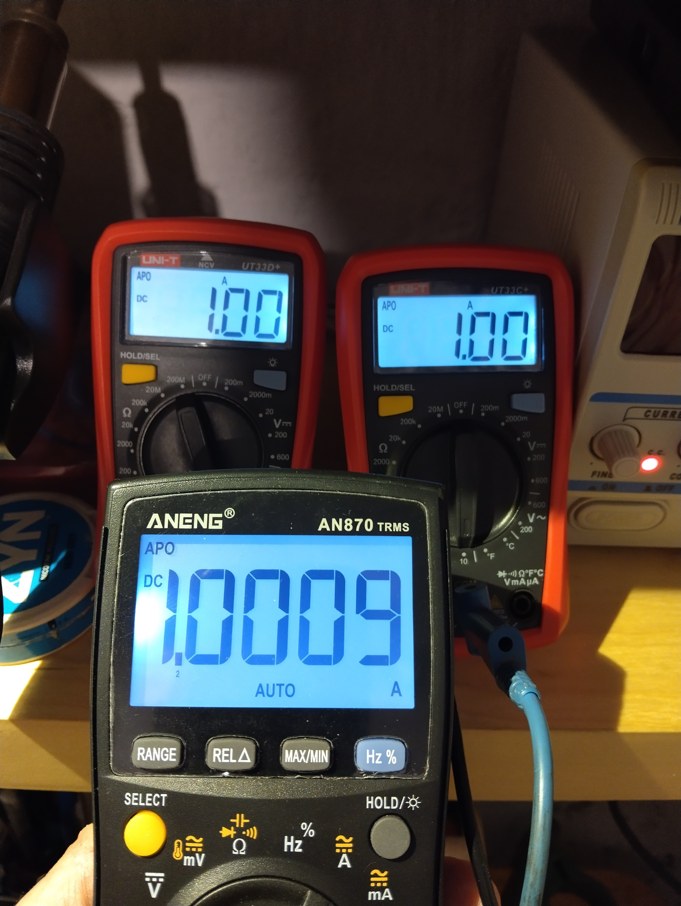
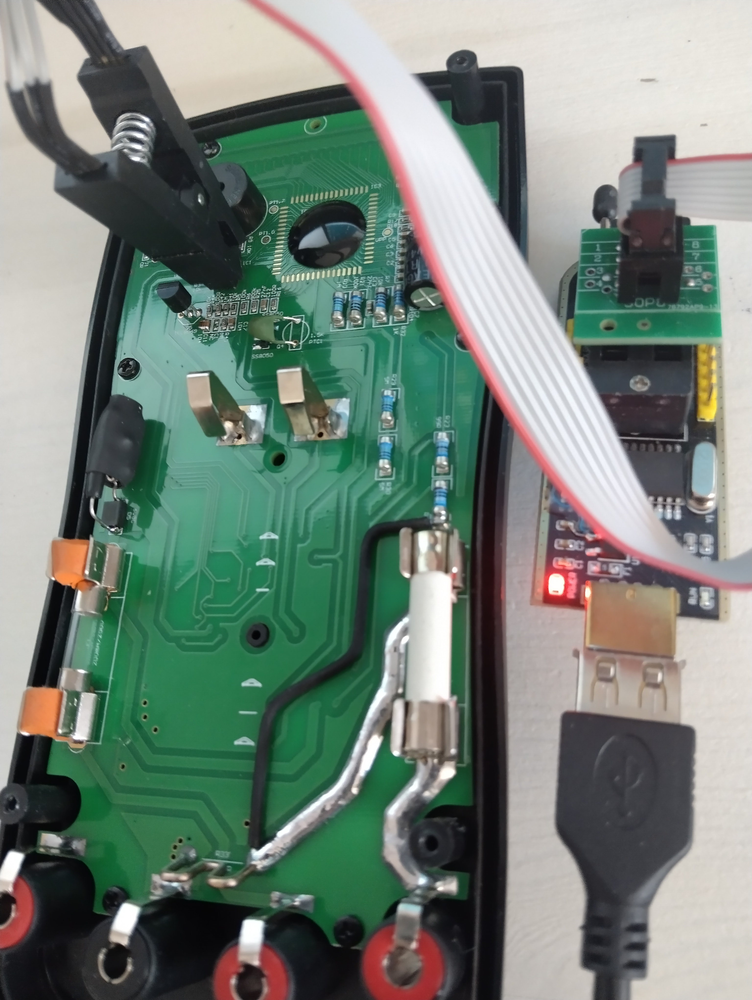

# Zoyi ZT219 / Aneng AN870 EEPROM Editor and HW improvements

Zoyi ZT219 / Aneng AN870 EEPROM Editor written in client-side in a single HTML page, fully offline.
A few HW improvements pointed.

You can download [offline eeprom editor](src/index.html)
and then just open index.html in a browser on your PC.
You can also use one [online eeprom editor](https://pawol.github.io/Zoyi-ZT219-Aneng-AN870-EEPROM-editor-calibration-modifications/src/index.html)

An example of dumped eeprom
[eeprom dump file](doc/aneng_870_original_eeprom_dump.bin)

# Introduction

This project was created to alleviate the pain of hand-editing the hex dump and to explore contemporary JavaScript syntax along with API supported by the modern Chrome browser (other browsers not tested - pull requests fixing possible issues are welcomed!).

Should you notice any errors, want to add missing range, update the description, etc. feel free to open an issue or submit a pull request.

It should be rather easy task to modify the source code to support any other `EEPROM` - the page is generated dynamically based on [the `bin_ranges` variable]

Keep in mind, every modification you make is your own risk!

# Hardware improvements

Look at the original

I suggest to introduce some hardware modifications.
The most important is to add additional bridge of 5x diodes 1N4007 (or M7 diodes) pararelly to the existing transil 6,8V to ensure better protection of 1 ohm/0.2W
shunt in case of accidential connection of ammeter (200mA range) directly into 230 VAC socket. 
Transil is cheap and... nothing more. 6,8V makes that shunt resitor 1 ohm/0.2W has to bear 10x more power than in case of bridge.
The bridge is first early stage "relief" and starts to work at 2V , TVS becomes 2nd stage protection.
The 5 diodes bridge (popular solution in the majority of multimeters) does not impact a measurement precision on uA and mA range at all.
Additional capacitors improve readout stability.
It is required also to improve measurement of ammeter on 20A range. There is bug in Kelvin connection originally.
Just cut one path and add second one properly and make main current pathes thicker.
The main current path originally has 25% of resistance R33 shunt! 0,0025 mOhm versus 0,01 Ohm.
The main current path originally is unstable part of R33 shunt!
Voltage drop on that pathes is huge!
Recalibration on 20A is necessary. This is quit easy task to do.
Recalibration details are described below.

# How to recalibrate Zoyi ZT219 / Aneng AN870 properly

[How to recalibrate](doc/calibration.txt)

# How to reprogram eeprom after editing
Just use the cheapest and common ch341 based programer
We need to reprogram popular 24c02 eeprom, the clip is extremally comfortable to do it.

# Datasheets and documentation

[Aneng AN870/Zoyi ZT219 schematic diagram](doc/Zoyi_zt219_Aneng_an870_v3.1_schematic.pdf)

[datasheet 1](doc/DTM0660_datasheet.pdf)

[datasheet 2](doc/DTM0660_datasheet_auto-translated.pdf)

[datasheet 3](doc/DS-HY12P65_EN.pdf)
